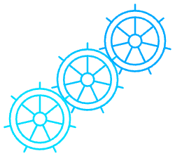

# multi-k8s



multi-k8s is a go cli which uses multipass to deploy k8s clusters on your macos.

### Pre-requisites

Make sure to:
- have Go installed on your Mac (https://go.dev/doc/install)
- have latest Multipass version installed on your Mac (https://multipass.run/docs/install-multipass)

Install it using the commands below:

```
# Use go install to download, build, and install the binary
go install github.com/andrei-don/multi-k8s@latest

# Ensure the Go bin directory is in your PATH
export PATH=$PATH:$(go env GOPATH)/bin

# Verify the installation
multi-k8s --help
```